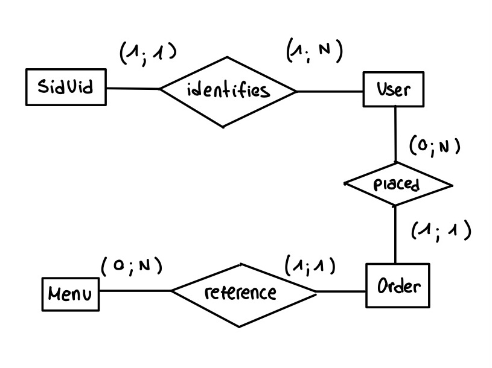

# ASP.NET-Core-Web-API - DEVELOPMENT JOURNAL

[](https://learn.microsoft.com/en-us/dotnet/csharp/)
[](https://learn.microsoft.com/en-us/aspnet/core/web-api/)

Backend created for the food delivery app.  

**The problem:** My Kotlin app couldn't retrieve data anymore because the web app had been shut down.<br>
That meant I couldn't see my application working properly, and that's why I decided to start this project.

> I've studied and created this project by myself;
> This very basic project is a nice exercise that allows me to move beyond the stage where everything simply works to a project that will leave me with a set of valuable lessons on a complex backend framework.

# REFACTORING:

## 1. ABSTRACTION BY SPECIFICATION / (DESIGN BY CONTRACT)
When looking at my project, I couldn't be satisfied with my "OrderController" class; I knew that my methods were taking on way too many responsibilities, and even I couldn't comprehend it at first glance.<br>
The first thing I thought was that I clearly wasn't using the framework's standard architecture in the best way, so I wanted to add a few comments to help me out in the process of **separation of concerns**.<br>

Right away, I remembered my OOP class in Java and Liskov's book:
**abstraction by specification**.

📚 [Barbara Liskov & John Guttag — *Program Development in Java:
Abstraction, Specification, and Object-Oriented Design*](https://www.oreilly.com/library/view/program-development-in/9780768685299/)

Thanks to ChatGPT, I've learned about the existence of XML Documentation comments, and that's what I've used to add my Liskov-friendly comments.

> My comments specify the effects and modifications of those methods. The method's signature makes returns explicit (my signatures needed refactoring too), and for my sanity's sake, I'll assume there are no errors in my methods to specify.

**Let's go over what Liskov said in her book about procedural abstractions:** <br>
- **headers / (method signatures):** "gives the name of the procedure, the number, order, and types of its parameters and the type of its results" "it's similar to the "form" of a mathematical function, as in 
f: integer->integer".<br>
- **requires:** "The requires clause states the constraints under which the abstraction is defined. The requires clause is needed if the procedure is partial; if the procedure is total, it can be omitted".<br>
- **modifies:** "The modifies clause lists the names of any inputs that are modified by the procedure. If some inputs are modified, we say the procedure has a side effect. The modifies clause can be omitted when no inputs are modified".<br>
- **effects:** "The effects clause describes the behavior of the procedure for all inputs not ruled out by the requires clause. It must define what outputs are produced and also what modifications are made to the inputs listed in the modifies clause. The effect clause is written under the assumption that the requires clause is satisfied, and it says nothing about the procedure's behavior when the requires clause is not satisfied".<br>

## 2. DEFINING THE DOMAIN AND ENTITIES' ROLES - BACK TO THE E-R SCHEMA
After defining the specifications of the Controller operations, the next step is to refactor the application by introducing a **Service Layer** and a **Repository layer**.
Where should someone start? I believed I needed to rewrite controllers, but the more I looked into it, the further I went from the controller implementation...

> The ASP.NET Core Web API framework is pushing me down to the data layer; probably it's trivial for someone who already knows the framework, but it's not that obvious when you're learning it from scratch.
> So I decided to look into it because it couldn’t be random.
> That’s when I found other interesting concepts: the **dependency rule**, **domain‑driven design**, and **onion architecture**, which ASP.NET Core Web API naturally encourages by design.
> This might be a good time to read Clean Architecture by Robert C. Martin…
> -> Apparently, this framework, like Spring Boot and Laravel, can be described as an **opinionated framework**; that means it follows a set of rules that came from several decades of software engineering research. Interesting, isn't it?

-> Moral of the story: I went back to the **Domain layer**.

Does the domain layer depend on anything? Technically, no. But to build it properly, you must have a clear idea of your data model - the conceptual model; let's get back to it.<br>
Now I desperately need my DB abstraction, and I regret my laziness when I chose not to draw it!
I chose to prioritize seeing my Kotlin app working, and saw the flip side of the coin of the "outcome-oriented" approach, neglecting abstraction.<br>
Should I regret it? I think, in this case, the goal was simply to move forward. Would I do it again? Yes.

### Descriptive documentation

**Entities:**
- **UidSid —** the session identity used by the client.
- **User -** the person using the app.
- **Menu -** the plate available for purchase.
- **Order -** the purchase made by a user.

**Relationships:**
- **UidSid - identifies -> User -** a UidSid identifies the session of a specific User (1, 1).
- **User - is identified by -> UidSid -** a User is identified by at least one UidSid (1, N).
- **User - places -> Order -** a User places zero or more Orders (0, N).
- **Order - is placed by -> User -** one Order is placed by one User (1, 1).
- **Order - refers to -> Menu -** each Order refers to one Menu (1, 1).
- **Menu - is referenced by -> Order -** each Menu can be referred to by zero or more Orders (0, N).

### TEENY-TINY E-R SCHEMA


### TEENY-TINY RELATIONAL SCHEMA
```HTML
- uidSid(🔑 sid, 🔗 uid)

- user(
    🔑 uid,
    first_name,
    last_name,
    card_full_name,
    card_number,
    card_expire_month,
    card_expire_year,
    card_cvv,
    🟨🔗 last_oid,
    🟪🔗 order_status
)

- menu(
    🔑 mid,
    name,
    price,
    location_lat,
    location_lng,
    image_version,
    image,
    short_description,
    long_description,
    🟩🔗 delivery_time
)

- order(
    🟨🔑 oid,
    🔗 uid,
    🔗 mid,
    creation_timestamp,
    🟪🔗 status,
    delivery_location_lat,
    delivery_location_lng,
    🟩🔗 expected_delivery_timestamp,
    delivery_timestamp,
    current_position_lat,
    current_position_lng
)
```
## 3. IMPLEMENTATION
### Domain Layer

# OVERVIEW: Layered Web API Architecture - description
#### 1. Domain / Data Layer - Models + DbContext
#### 2. Repository Layer - DB access
#### 3. Application / Service Layer - Service
#### 4. Presentation Layer - Controller
