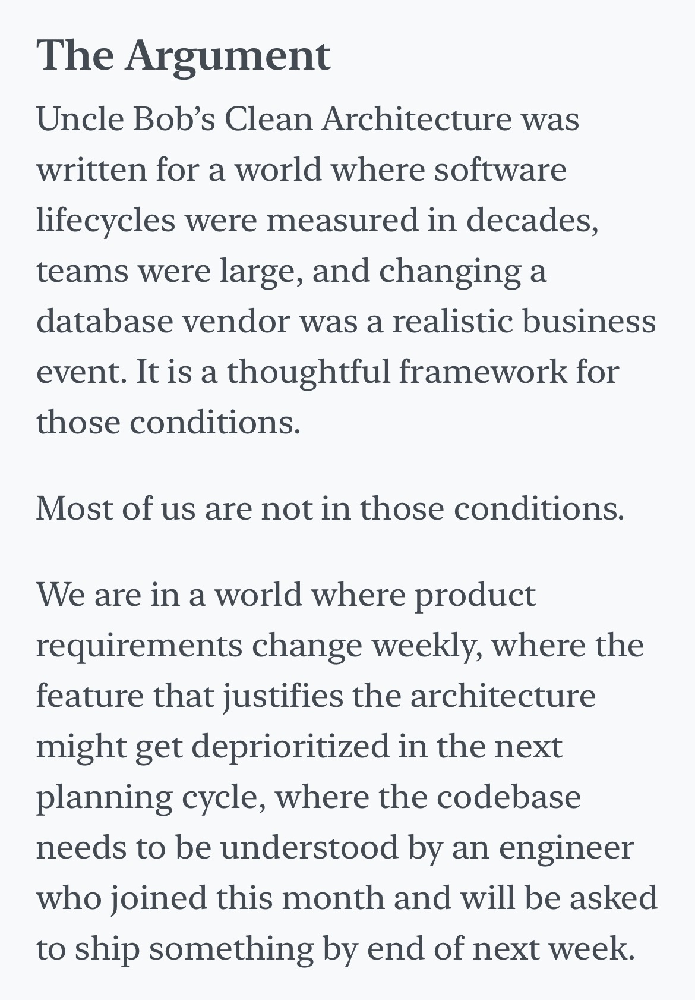
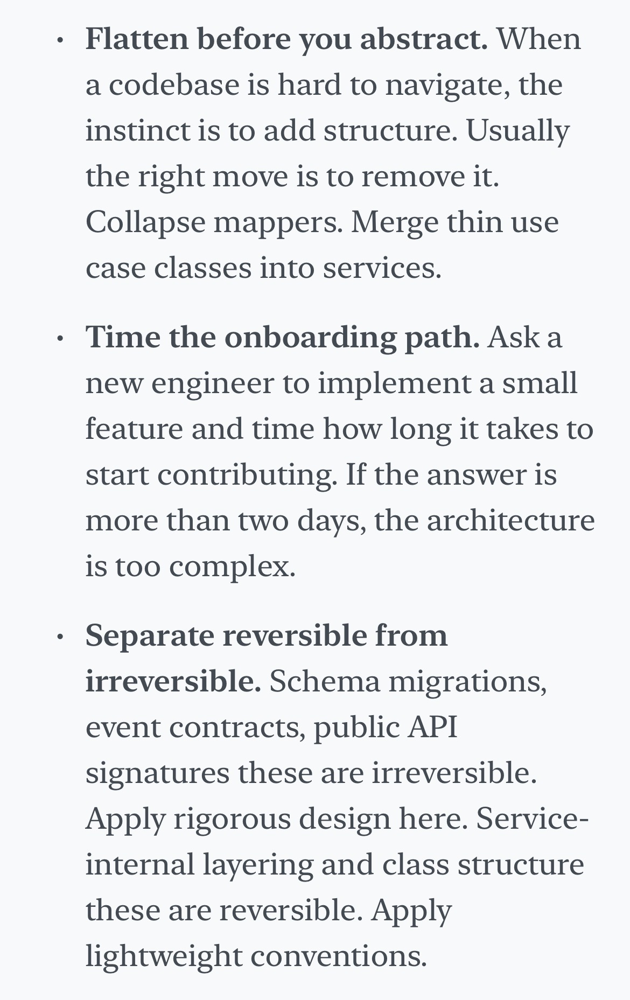
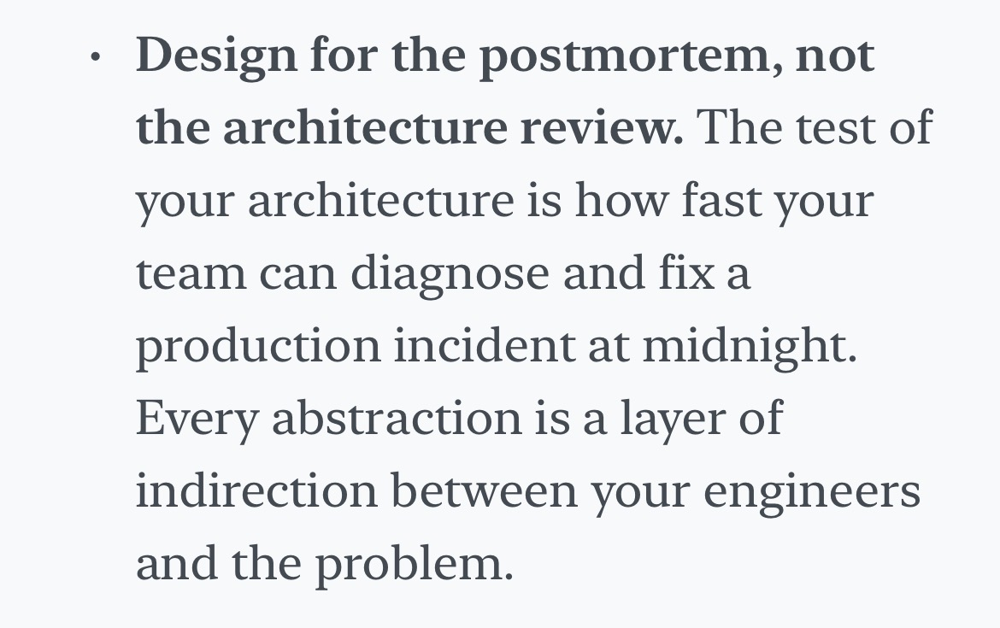
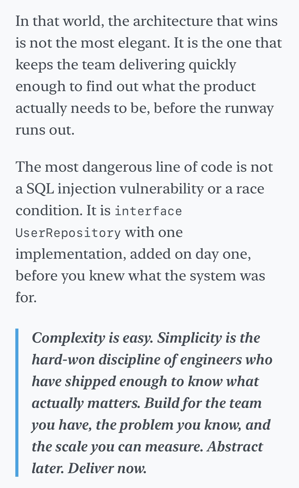

# Choosing when and how to implement Clean Architecture's concepts
## Scientific research isn't dogmatic: it's a given tool. 

**Real-world scenarios POV:** The article I just read on Substack: [Clean Architecture slows teams - The modern backend](https://modernbackend.substack.com/p/clean-architecture-slows-teams?r=8itj4t&utm_medium=ios).

### Lessons taught by a nowhere-located senior:

 

## Why Refactoring? A Lesson in Pragmatism vs. Perfectionism

Reading an article on Substack made me consider refactoring this project—again. But then I thought: was the "ugly" version really that bad?
That first version was messy code written in three days with Copilot's help. It did its job. Users got what they needed. Speed and delivery mattered more than architecture.

### The University Mindset vs. Reality

At university, I was the type to obsess over trying to deeply understand everything.  
But **Milan is a city that runs at the speed of outcomes**, which is crazy and stressful, but it gives you an outlook when you push aside self-reservation:

**The things you can *show* are valuable.**
It's a matter of:
- Communication (can I bring this work to someone and will the interlocutor understand? Firstly, I have to have something understandable to show)
- Trial-and-error (does it work in the real world? And no, you will not pre-establish that with your extraordinary logical talent)
- Moving forward
- Gathering real feedback (users, the system, your teammate, everything will give you unexpected valuable feedback, and there will start another creative outlook upon the first one)

### The Moral
Not everything can and should be in your head forever. Outcome is important; refactoring bad code becomes the next conversation.
